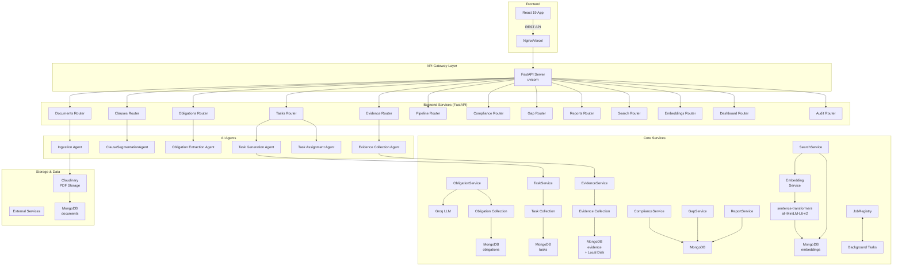

# RegTrace

## Overview

RegTrace is an AI-powered regulatory compliance platform that automates the end-to-end lifecycle of obligations extraction from regulatory documents — turning PDFs into actionable compliance tasks, evidence workflows, gap analysis, and audit-ready reports.

Built for financial services regulators (SEBI-style intermediaries) and their compliance teams, RegTrace ingests regulatory documents, segments them into clauses, extracts obligations via LLM reasoning, generates operational tasks, tracks evidence submission, evaluates compliance, runs gap analysis, and produces exportable audit reports — all through a single full-stack application with a React frontend and FastAPI backend.

---

## Problem

Financial services intermediaries (stockbrokers, depositories, clearing members) must comply with hundreds of pages of evolving regulatory circulars issued by authorities like SEBI. Manual compliance teams face:

- **Manual extraction**: Compliance officers read dense 50–200 page circulars and manually identify obligations — error-prone and slow.
- **Lost obligations**: Critical regulatory requirements get buried in PDF text or missed entirely during review.
- **No audit trail**: When regulators ask for proof of compliance, teams scramble to compile scattered evidence across emails, drive folders, and spreadsheets.
- **Stale tracking**: Obligations and deadlines are tracked in spreadsheets that quickly go out of sync with document versions.
- **Inconsistent tasking**: Without structured workflows, the same obligation is sometimes tracked across multiple systems — or not tracked at all.

The result is compliance risk, regulatory penalties, and enormous manual overhead for compliance managers who must orchestrate reviews, task generation, and evidence collection across multiple departments.

---

## Solution

RegTrace provides a single platform that automates the full compliance pipeline:

1. **Upload** any regulatory PDF — it's stored on Cloudinary and parsed page-by-page.
2. **Segment** the document into structured clauses with preserved hierarchy and page references.
3. **Extract** obligations from each clause using a Groq LLM (`llama-3.3-70b-versatile`), capturing actor, action, condition, deadline, frequency, and mandatory flags.
4. **Generate** operational tasks from approved obligations — categorized by compliance domain (Reporting, KYC, Cybersecurity, etc.) with priority and recurrence rules.
5. **Collect** evidence — departments submit supporting files linked to specific tasks.
6. **Evaluate** overall compliance status across the obligation→task→evidence chain with departmental breakdowns.
7. **Analyze gaps** — identify overdue tasks, rejected evidence, unreviewed obligations, and missing task generation.
8. **Generate reports** — produce PDF/JSON audit reports for internal and external review.

All stages are traceable: every obligation links back to its source clause, every task links to its source obligation, and every evidence submission links to its task — creating a complete audit trail from regulatory text to compliance proof.

---

## Features

### Document Management
- PDF upload with automatic metadata extraction and Cloudinary storage
- SHA-256 content hashing for duplicate detection
- Multi-field document metadata (title, document type, source, publication date, intermediary category, language)
- Full document status lifecycle (UPLOADED → PARSED → CHUNKED → EMBEDDED → CLAUSES_CREATED → EXTRACTING_OBLIGATIONS → OBLIGATIONS_REVIEWED → GENERATING_TASKS → TASKS_CREATED → EVIDENCE_SUBMITTED → COMPLIANCE_EVALUATED → GAP_ANALYSIS_COMPLETED → REPORT_GENERATED)
- Soft-delete protection: cannot delete a document with in-flight background jobs
- Pipeline cancellation with cooperative job termination

### Clause Segmentation
- Layout-aware PDF parsing using PyMuPDF (preserves text blocks, positional context)
- Clause hierarchy repair (fixes missing indentation, renumbers sequence gaps)
- Per-clause obligation detection flag (`has_obligations`)
- Manual re-segmentation trigger

### Obligation Extraction
- LLM-powered extraction from each clause using Groq's `llama-3.3-70b-versatile`
- Captures: actor, action, condition, deadline, frequency, mandatory flag, confidence score (0.0–1.0)
- Batch processing with per-clause structured output
- Review workflow: approve, reject, or edit with reviewer + comment
- Bulk approval of multiple obligations
- Full review-history audit trail per obligation

### Task Generation
- Operational task creation from approved obligations
- Standardized compliance categories: Reporting, Record Keeping, Audit, Grievance Redressal, Cybersecurity, Disclosure, Monitoring, Governance, Operational Compliance
- Priority levels: Critical, High, Medium, Low
- Recurrence rules: One-time, Event-based, Monthly, Quarterly, Half-yearly, Annual, Continuous Monitoring
- Department assignment: Compliance, Operations, KYC, IT, Information Security, Finance, Legal, Risk
- Due rules and evidence requirements per task
- Background processing with job cancellation support

### Evidence Collection
- Multi-file upload support (PDF, images, CSV, TXT, logs)
- Direct-to-disk local storage with Cloudinary fallback for legacy records
- Evidence status lifecycle: Submitted → Accepted/Rejected
- Per-task and per-document evidence listing
- File streaming with correct MIME types

### Compliance Evaluation & Gap Analysis
- Real-time compliance score calculation
- Status breakdowns by department, category, and priority
- Gap detection across 9 gap types: obligation not reviewed, obligation rejected, no tasks generated, task unassigned, task not started, task overdue, evidence missing, evidence pending, evidence rejected
- Severity tiers: Critical, High, Medium, Low
- Top-priority gap surfacing for immediate action

### Search
- Hybrid keyword + semantic search across clauses, obligations, and documents
- Configurable search mode: KEYWORD | SEMANTIC | ALL
- Filterable by document ID and result type
- Embedding-based semantic search using `sentence-transformers/all-MiniLM-L6-v2` (384-dimensional vectors)

### Audit & Reporting
- Audit log for all pipeline events and state transitions
- Preview and generate audit reports with full compliance summary
- Export to PDF or JSON
- Dashboard KPIs: total obligations, compliant count, pending tasks, critical gaps

---

## Tech Stack

### Backend
| Layer | Technology |
|-------|-----------|
| Framework | FastAPI 0.110.1 |
| Server | Uvicorn 0.49.0 |
| Database | MongoDB (Motor 3.7.1 async driver) |
| LLM | Groq API (`llama-3.3-70b-versatile`) |
| Embeddings | sentence-transformers (`all-MiniLM-L6-v2`, 384-dim) |
| Storage | Cloudinary (PDFs) + local disk (evidence) |
| PDF Parsing | PyMuPDF `pymupdf` 1.28.0 |
| OCR | pytesseract + pdf2image |
| Task Queue | FastAPI BackgroundTasks |
| Serverless | Mangum 0.17.0 (Vercel handler) |

### Frontend
| Layer | Technology |
|-------|-----------|
| Framework | React 19 (hooks) |
| Build | Vite 8 |
| Routing | React Router DOM 7 |
| Styling | Tailwind CSS 4 + `clsx` + `tailwind-merge` |
| Forms | react-hook-form + zod |
| Drag-and-Drop | @dnd-kit/core, sortable, modifiers |
| Icons | lucide-react |
| Charts | recharts |
| Motion | framer-motion |
| Type Safety | TypeScript 6 + zod |

### Infrastructure
| Environment | Stack |
|-------------|-------|
| Backend Hosting | Render (Python 3.11) |
| Frontend Hosting | Vercel (static build) |
| File Storage | Cloudinary |
| Database | MongoDB (managed or local) |

---

## Architecture



### Request Flow

1. **Document Upload**: Frontend POSTs a PDF to `/api/documents/upload` → backend reads file content, computes SHA-256 hash, uploads to Cloudinary → stores `DocumentOutput` record in `documents` collection → triggers `ClauseSegmentationAgent` as a background task.

2. **Clause Segmentation**: The agent reads all pages from the document record, reconstructs clause hierarchy using layout geometry (PyMuPDF blocks), repairs numbering and indentation gaps, validates hierarchy with `clause_validator.py`, and writes clauses to the `clauses` collection. Document status advances to `CLAUSES_CREATED`.

3. **Obligation Extraction**: On POST `/api/obligations/document/{id}/extract` → `ObligationService.process_document_obligations` reads all clauses for the document, batches them into LLM requests via Groq (`llama-3.3-70b-versatile`), parses structured obligation lists from each batch, and writes to `obligations` collection. Each obligation is linked to its source clause and includes a confidence score (0.0–1.0). Document status → `OBLIGATIONS_EXTRACTED`.

4. **Review Phase**: Compliance officers review each obligation via PUT `/api/obligations/{id}/review` — approving, rejecting, or editing actor/action/deadline fields, with reviewer name and comment recorded in `review_history`. When the last obligation is reviewed, document status → `OBLIGATIONS_REVIEWED`.

5. **Task Generation**: On POST `/api/tasks/document/{id}/generate` → `TaskService.process_document_tasks` reads all approved obligations, batches them to the LLM for task decomposition, and writes structured tasks (with category, priority, recurrence, evidence_required, recommended_owner) to the `tasks` collection. Document status → `TASKS_CREATED`.

6. **Evidence Submission**: Departments submit evidence files via POST `/api/evidence/` → files stored on local disk → record written to `evidence` collection linking to `task_id`, `document_id`, `obligation_id`. Evidence status starts as `SUBMITTED`.

7. **Compliance Evaluation**: ComplianceService computes compliance status per obligation by checking task completion + accepted evidence counts. Status computed: COMPLIANT (all obligations' tasks done + evidence accepted), PARTIALLY_COMPLIANT (some pending/rejected), NON_COMPLIANT (critical gaps). Results available via `/api/compliance/overview` and `/api/compliance/obligations`.

8. **Gap Analysis**: GapService scans all obligations for 9 gap types (unreviewed, rejected, no tasks, unassigned, not started, overdue, missing/pending/rejected evidence) and assigns severity. Results via `/api/gap/overview` and `/api/gap/items`.

9. **Reporting**: ReportService builds an `AuditReport` (summary, compliance breakdown, gap breakdown, obligation details) from the current state. Can be previewed (not persisted) or generated (persisted). Export to JSON or PDF via `/api/reports/{id}/export`.

10. **Search & Embeddings**: EmbeddingService generates 384-dim vectors for all clauses and obligations using `sentence-transformers/all-MiniLM-L6-v2`. SearchService supports keyword (text index) and semantic (cosine similarity) search modes, combined via `/api/search` with `mode=ALL`.

11. **Pipeline Control**: The `job_registry.py` module provides cooperative cancellation — any background job checks the registry between batches. `POST /api/pipeline/{document_id}/cancel` marks the job for cancellation and the status flips to `PROCESSING_CANCELLED`. Stale-job detection (30-second grace window + no live job) auto-fails stuck runs.

---

## Installation & Setup

### Prerequisites
- Python 3.11+
- Node.js 22+
- MongoDB (local or MongoDB Atlas)
- Cloudinary account (for file storage)
- Groq API key (for LLM-powered extraction)

### Backend Setup

```bash
cd backend

# 1. Install dependencies
pip install -r ../requirements.txt

# 2. Create .env file
cat > .env << EOF
MONGODB_URI=mongodb://localhost:27017
DATABASE_NAME=RegTrace
CLOUDINARY_CLOUD_NAME=your-cloud-name
CLOUDINARY_API_KEY=your-api-key
CLOUDINARY_API_SECRET=your-api-secret
GROQ_API_KEY=your-groq-api-key
CORS_ORIGINS=*
EOF

# 3. Run the server
uvicorn app.main:app --reload --port 8000
```

### Frontend Setup

```bash
cd frontend

# 1. Install dependencies
npm install

# 2. Create .env file
cat > .env << EOF
VITE_API_URL=http://localhost:8000
EOF

# 3. Run the dev server
npm run dev
```

### One-Click Deployment

**Backend (Render):**
```bash
# Push to GitHub, then create a Web Service on Render
# Build command: pip install -r requirements.txt
# Start command: uvicorn app.main:app --host 0.0.0.0 --port $PORT
# Set env vars: MONGODB_URI, DATABASE_NAME, CLOUDINARY_*, GROQ_API_KEY, CORS_ORIGINS
```

**Frontend (Vercel):**
```bash
npm run build
# Deploy the frontend/dist directory to Vercel
# Or connect the repo to Vercel for automatic deployment
```

---

## Usage

### Quick Start

1. Start both backend and frontend servers (see Installation & Setup above).
2. Open `http://localhost:5173` in your browser.
3. Upload a regulatory PDF via the **Documents** page.
4. The pipeline begins automatically:
   - PDF is parsed and clauses are segmented.
   - Navigate to **Clauses** to review the segmented hierarchy.
5. Go to **Obligations** and click "Extract Obligations" — the LLM will process each clause.
6. Review each obligation (Approve / Reject / Edit) with reviewer notes.
7. Go to **Tasks** and click "Generate Tasks" — the system creates operational tasks from approved obligations.
8. Go to **Evidence** to submit supporting files for assigned tasks.
9. Navigate to **Compliance** or **Gap Analysis** to see your compliance posture.
10. Go to **Audit Reports** to generate a PDF or JSON audit report.

### Navigation Structure

| Group | Pages |
|-------|-------|
| **Dashboard** | Overview KPIs, pending reviews, quick links |
| **Ingest** | Pipeline (job status, cancellation) · Documents (upload, delete, list) |
| **Analyze** | Clauses (hierarchy, re-segment) · Obligations (extract, review, bulk-approve) · Tasks (assign, update status) · Evidence (submit, review, download) |
| **Assurance** | Compliance (overview, obligation drill-down) · Gap Analysis (items, severity filters) · Audit Reports (generate, preview, export) |

### Pipeline Controls

- **Cancel a running pipeline**: `POST /api/pipeline/{document_id}/cancel` — requests cooperative cancellation of obligation extraction or task generation.
- **Re-run clause segmentation**: `POST /api/clauses/documents/{document_id}/segment`.
- **Re-extract obligations**: `POST /api/obligations/document/{document_id}/extract`.
- **Regenerate tasks**: `POST /api/tasks/document/{document_id}/generate`.
- **Regenerate embeddings**: `POST /api/embeddings/generate?document_id={document_id}`.

---

## Screenshots

Drop screenshot images into the `screenshots/` folder and they will be automatically referenced here:


---

## API Documentation

All endpoints are served under `/api` (the frontend normalizes the `/api` prefix automatically). No authentication is required in the current build.

### Documents

| Method | Endpoint | Description |
|--------|----------|-------------|
| `GET` | `/api/documents/` | List all documents (sorted by upload timestamp, newest first) |
| `POST` | `/api/documents/upload` | Upload a PDF document with metadata |
| `DELETE` | `/api/documents/{document_id}` | Delete a document + all related clauses, obligations, tasks |

**Upload Request (multipart/form-data):**
```
POST /api/documents/upload
Content-Type: multipart/form-data

file: <PDF file>
title: "Master Circular Example"
category: "Master Circular"
description: "SEBI/2024/123"
source: "SEBI"
publicationDate: "2024-01-15"
effectiveDate: "2024-01-15"
language: "English"
referenceNumber: "MC-2024-123"
intermediaryCategories: ["Stock Broker", "Sub-broker"]
```

**Upload Response:**
```json
{
  "document_id": "550e8400-e29b-41d4-a716-446655440000",
  "title": "Master Circular Example",
  "document_type": "Master Circular",
  "intermediary_category": "STOCKBROKER",
  "source": "SEBI",
  "publication_date": "2024-01-15",
  "file_storage_path": "https://res.cloudinary.com/.../regtrace/550e8400...pdf",
  "file_size": 2048576,
  "file_hash": "a1b2c3d4e5f6...",
  "upload_timestamp": "2025-08-17T10:30:00",
  "processing_status": "PARSED",
  "metadata": {
    "title": "Master Circular Example",
    "document_type": "Master Circular",
    "source": "SEBI",
    "language": "English",
    "publication_date": "2024-01-15",
    "intermediary_category": "STOCKBROKER"
  }
}
```

**List Documents Response:**
```json
[
  {
    "document_id": "550e8400-e29b-41d4-a716-446655440000",
    "title": "Master Circular Example",
    "document_type": "Master Circular",
    "intermediary_category": "STOCKBROKER",
    "source": "SEBI",
    "publication_date": "2024-01-15",
    "file_storage_path": "https://res.cloudinary.com/...",
    "file_size": 2048576,
    "file_hash": "a1b2c3d4e5f6...",
    "upload_timestamp": "2025-08-17T10:30:00",
    "processing_status": "CLAUSES_CREATED",
    "metadata": { "title": "...", "document_type": "...", ... }
  }
]
```

### Clauses

| Method | Endpoint | Description |
|--------|----------|-------------|
| `GET` | `/api/clauses/documents/{document_id}/clauses` | Get all segmented clauses for a document |
| `GET` | `/api/clauses/{clause_id}` | Get a single clause by ID |
| `POST` | `/api/clauses/documents/{document_id}/segment` | Trigger clause segmentation manually |

**Get Clauses Response:**
```json
[
  {
    "clause_id": "c1a2b3d4",
    "document_id": "550e8400-e29b-41d4-a716-446655440000",
    "clause_text": "All intermediaries shall maintain proper books of accounts.",
    "clause_number": "3(1)(a)",
    "page_number": 5,
    "level": 2,
    "parent_clause_id": "c1a2b3d0",
    "has_obligations": true,
    "created_at": "2025-08-17T11:00:00"
  }
]
```

### Obligations

| Method | Endpoint | Description |
|--------|----------|-------------|
| `GET` | `/api/obligations/` | List obligations, optionally filtered by `document_id` or `status` |
| `POST` | `/api/obligations/document/{document_id}/extract` | Trigger LLM obligation extraction in background |
| `PUT` | `/api/obligations/{obligation_id}/review` | Approve, reject, or edit an obligation |
| `GET` | `/api/obligations/{obligation_id}/reviews` | Get review history for an obligation |
| `PUT` | `/api/obligations/bulk-approve` | Approve multiple obligations at once |

**Extract Obligations Response:**
```json
{
  "message": "Obligation extraction started in the background",
  "document_id": "550e8400-e29b-41d4-a716-446655440000"
}
```

**Review Obligation Request:**
```
PUT /api/obligations/{obligation_id}/review
Content-Type: application/json

{
  "status": "APPROVED",
  "reviewer": "compliance.officer@example.com",
  "comment": "Verified against source clause 3(1)(a)"
}
```

**Get Obligations Response:**
```json
[
  {
    "id": "ob123456",
    "document_id": "550e8400-e29b-41d4-a716-446655440000",
    "clause_id": "c1a2b3d4",
    "actor": "intermediary",
    "action": "maintain proper books of accounts",
    "condition": "at all times",
    "deadline": "ongoing",
    "frequency": "Continuous",
    "is_mandatory": true,
    "confidence_score": 0.96,
    "status": "PENDING",
    "created_at": "2025-08-17T11:15:00",
    "updated_at": "2025-08-17T11:15:00"
  }
]
```

**Bulk Approve Request:**
```
PUT /api/obligations/bulk-approve
Content-Type: application/json

{
  "obligation_ids": ["ob123456", "ob789012"]
}
```

**Bulk Approve Response:**
```json
{
  "modified_count": 2
}
```

### Tasks

| Method | Endpoint | Description |
|--------|----------|-------------|
| `GET` | `/api/tasks/` | List tasks with optional filters (`document_id`, `status`, `department`, `priority`) |
| `GET` | `/api/tasks/{task_id}` | Get a single task by ID |
| `PUT` | `/api/tasks/{task_id}` | Update task status, department, or fields |
| `POST` | `/api/tasks/{task_id}/assign` | Assign or reassign a task to a department |
| `POST` | `/api/tasks/document/{document_id}/generate` | Trigger task generation from approved obligations |

**Query Parameters for GET /tasks/:**
| Parameter | Values | Description |
|-----------|--------|-------------|
| `document_id` | string | Filter by document ID |
| `status` | `PENDING_ASSIGNMENT`, `ASSIGNED`, `IN_PROGRESS`, `COMPLETED`, `OVERDUE`, `CANCELLED` | Filter by task status |
| `department` | `Compliance`, `Operations`, `KYC/Client Onboarding`, `IT`, `Information Security`, `Finance`, `Legal`, `Risk` | Filter by assigned department |
| `priority` | `Critical`, `High`, `Medium`, `Low` | Filter by priority |

**Get Tasks Response:**
```json
[
  {
    "id": "task_abc123",
    "document_id": "550e8400-e29b-41d4-a716-446655440000",
    "obligation_id": "ob123456",
    "clause_id": "c1a2b3d4",
    "title": "Maintain daily transaction logs",
    "description": "Record all buy/sell transactions with timestamps and quantities in a tamper-proof log",
    "category": "Record Keeping",
    "priority": "High",
    "due_rule": "Daily, before end of trading day",
    "recurrence": "Continuous",
    "evidence_required": ["Transaction log file"],
    "clause_reference": "3(1)(a)",
    "page_number": 5,
    "recommended_owner": "Compliance",
    "assigned_department": "Compliance",
    "status": "IN_PROGRESS",
    "created_at": "2025-08-17T12:00:00",
    "updated_at": "2025-08-17T12:00:00"
  }
]
```

### Evidence

| Method | Endpoint | Description |
|--------|----------|-------------|
| `POST` | `/api/evidence/` | Submit evidence (multipart/form-data) |
| `GET` | `/api/evidence/task/{task_id}` | List all evidence for a task |
| `GET` | `/api/evidence/document/{document_id}` | List all evidence for a document |
| `GET` | `/api/evidence/{evidence_id}` | Get a single evidence record |
| `GET` | `/api/evidence/{evidence_id}/file` | Stream the stored evidence file |
| `PUT` | `/api/evidence/{evidence_id}` | Update evidence status or description |

**Submit Evidence Request (multipart/form-data):**
```
POST /api/evidence/
Content-Type: multipart/form-data

task_id: "task_abc123"
document_id: "550e8400-e29b-41d4-a716-446655440000"
obligation_id: "ob123456"
description: "Daily transaction log for Aug 17"
submitted_by: "compliance.officer@example.com"
file: <log file>
```

**Submit Evidence Response:**
```json
{
  "id": "ev_001",
  "task_id": "task_abc123",
  "document_id": "550e8400-e29b-41d4-a716-446655440000",
  "obligation_id": "ob123456",
  "file_name": "transaction_log_2025-08-17.csv",
  "file_type": "csv",
  "file_url": "/api/evidence/ev_001/file",
  "file_size": 4096,
  "description": "Daily transaction log for Aug 17",
  "submitted_by": "compliance.officer@example.com",
  "status": "SUBMITTED",
  "clause_reference": "3(1)(a)",
  "page_number": 5,
  "submitted_at": "2025-08-17T13:00:00",
  "updated_at": "2025-08-17T13:00:00"
}
```

**Update Evidence Request:**
```
PUT /api/evidence/{evidence_id}
Content-Type: application/json

{
  "status": "ACCEPTED",
  "description": "Verified and compliant"
}
```

### Pipeline

| Method | Endpoint | Description |
|--------|----------|-------------|
| `GET` | `/api/pipeline/overview` | Get all documents with counts (clauses, obligations, tasks) and statuses |
| `POST` | `/api/pipeline/{document_id}/cancel` | Cancel a running pipeline job (cooperative) |

**Pipeline Overview Response:**
```json
{
  "documents": [
    {
      "document_id": "550e8400-e29b-41d4-a716-446655440000",
      "title": "Master Circular Example",
      "processing_status": "CLAUSES_CREATED",
      "upload_timestamp": "2025-08-17T10:30:00",
      "document_type": "Master Circular",
      "source": "SEBI",
      "publication_date": "2024-01-15",
      "page_count": 50,
      "file_size": 2048576,
      "clause_count": 120,
      "obligation_clause_count": 85,
      "clauses_processed": 85,
      "tasks_processed": 0,
      "obligations": {
        "total": 85,
        "pending": 85,
        "approved": 0,
        "rejected": 0
      },
      "tasks": {
        "total": 0,
        "pending": 0,
        "assigned": 0,
        "in_progress": 0,
        "completed": 0,
        "overdue": 0
      }
    }
  ]
}
```

### Compliance

| Method | Endpoint | Description |
|--------|----------|-------------|
| `GET` | `/api/compliance/overview` | Get compliance summary with breakdown by department, category, priority |
| `GET` | `/api/compliance/obligations` | List obligations in compliance context with filters |

**Query Parameters for GET /compliance/obligations:**
| Parameter | Type | Description |
|-----------|------|-------------|
| `document_id` | string | Filter by document |
| `status` | string | Filter by compliance status |
| `department` | string | Filter by department (case-insensitive) |
| `priority` | string | Filter by priority (case-insensitive) |

**Compliance Overview Response:**
```json
{
  "overall_score": 72.5,
  "total_obligations": 120,
  "status_counts": {
    "COMPLIANT": 87,
    "PARTIALLY_COMPLIANT": 22,
    "NON_COMPLIANT": 11,
    "NOT_STARTED": 0
  },
  "by_department": [
    {
      "key": "Compliance",
      "total": 45,
      "compliant": 40,
      "partial": 4,
      "non_compliant": 1,
      "not_started": 0,
      "score": 88.9
    }
  ],
  "by_category": [ ... ],
  "by_priority": [ ... ],
  "critical_gaps": [
    {
      "obligation_id": "ob789012",
      "action": "file quarterly compliance report",
      "department": "Legal",
      "status": "NON_COMPLIANT",
      "is_overdue": true,
      "is_mandatory": true
    }
  ]
}
```

### Gap Analysis

| Method | Endpoint | Description |
|--------|----------|-------------|
| `GET` | `/api/gap/overview` | Get gap summary (by severity, type, department) |
| `GET` | `/api/gap/items` | List all gap items with filters |

**Query Parameters for GET /gap/items:**
| Parameter | Type | Description |
|-----------|------|-------------|
| `severity` | string | Filter by `CRITICAL`, `HIGH`, `MEDIUM`, `LOW` |
| `type` | string | Filter by gap type enum |
| `department` | string | Filter by department |

**Gap Types:**
- `OBLIGATION_NOT_REVIEWED`
- `OBLIGATION_REJECTED`
- `NO_TASKS_GENERATED`
- `TASK_UNASSIGNED`
- `TASK_NOT_STARTED`
- `TASK_OVERDUE`
- `EVIDENCE_MISSING`
- `EVIDENCE_SUBMITTED_PENDING`
- `EVIDENCE_REJECTED`

**Gap Overview Response:**
```json
{
  "total_gaps": 33,
  "by_severity": {
    "CRITICAL": 5,
    "HIGH": 12,
    "MEDIUM": 10,
    "LOW": 6
  },
  "by_type": [
    {
      "key": "EVIDENCE_MISSING",
      "total": 15,
      "critical": 3,
      "high": 7,
      "medium": 4,
      "low": 1
    }
  ],
  "by_department": [ ... ],
  "top_priority_gaps": [
    {
      "gap_id": "gap_001",
      "obligation_id": "ob789012",
      "obligation_action": "file quarterly compliance report",
      "actor": "intermediary",
      "task_id": "task_xyz789",
      "task_title": "Prepare Q2 compliance report",
      "gap_type": "TASK_OVERDUE",
      "severity": "CRITICAL",
      "department": "Legal",
      "category": "Reporting",
      "priority": "High",
      "is_mandatory": true,
      "is_overdue": true,
      "description": "Task is overdue and no evidence has been submitted",
      "recommended_action": "Immediately assign to Legal department and submit evidence"
    }
  ]
}
```

### Reports

| Method | Endpoint | Description |
|--------|----------|-------------|
| `POST` | `/api/reports/generate` | Generate (persist) an audit report |
| `POST` | `/api/reports/preview` | Preview an audit report (not persisted) |
| `GET` | `/api/reports/` | List all previously generated reports |
| `GET` | `/api/reports/{report_id}` | Get a specific report |
| `GET` | `/api/reports/{report_id}/export` | Export report as JSON or PDF |

**Generate Report Request:**
```
POST /api/reports/generate
Content-Type: application/json

{
  "document_id": "550e8400-e29b-41d4-a716-446655440000",
  "generated_by": "compliance.officer@example.com"
}
```

**Generate Report Response:**
```json
{
  "report_id": "rpt_001",
  "report_type": "DOCUMENT",
  "document_id": "550e8400-e29b-41d4-a716-446655440000",
  "title": "Compliance Audit Report: Master Circular Example",
  "generated_at": "2025-08-17T14:00:00",
  "generated_by": "compliance.officer@example.com",
  "summary": {
    "total_obligations": 85,
    "compliant": 75,
    "partially_compliant": 7,
    "non_compliant": 3,
    "not_started": 0,
    "overall_compliance_score": 88.2,
    "total_gaps": 10,
    "critical_gaps": 3,
    "high_gaps": 5,
    "medium_gaps": 2,
    "low_gaps": 0
  },
  "compliance": { ... },
  "gaps": { ... },
  "obligations": [
    {
      "obligation_id": "ob123456",
      "action": "maintain proper books of accounts",
      "actor": "intermediary",
      "is_mandatory": true,
      "status": "COMPLIANT",
      "is_overdue": false,
      "tasks_total": 1,
      "tasks_completed": 1,
      "evidence_accepted": 1,
      "department": "Compliance"
    }
  ],
  "metadata": { ... }
}
```

**Export Report Response (PDF):**
Returns a `application/pdf` file with `Content-Disposition: attachment; filename="report_{report_id}.pdf"`.

**Export Report Response (JSON):**
Returns the report as a JSON object.

### Search

| Method | Endpoint | Description |
|--------|----------|-------------|
| `GET` | `/api/search?q=<query>` | Hybrid keyword + semantic search |

**Query Parameters:**
| Parameter | Type | Default | Constraints | Description |
|-----------|------|---------|-------------|-------------|
| `q` | string | **required** | `min_length=1` | Search query |
| `mode` | string | `ALL` | `KEYWORD`, `SEMANTIC`, `ALL` | Search mode |
| `type` | string | `ALL` | `ALL`, `CLAUSE`, `OBLIGATION`, `DOCUMENT` | Result type filter |
| `document_id` | string | optional | — | Restrict to one document |
| `limit` | integer | `30` | `1–100` | Max results |

**Search Response:**
```json
{
  "query": "books of accounts",
  "mode": "ALL",
  "total": 3,
  "results": [
    {
      "type": "CLAUSE",
      "id": "c1a2b3d4",
      "document_id": "550e8400-e29b-41d4-a716-446655440000",
      "title": "Clause 3(1)(a)",
      "snippet": "...shall maintain proper books of accounts...",
      "meta": { "clause_number": "3(1)(a)", "page_number": 5 },
      "score": 0.92,
      "link": "/clauses/c1a2b3d4"
    }
  ]
}
```

### Embeddings (Internal)

| Method | Endpoint | Description |
|--------|----------|-------------|
| `POST` | `/api/embeddings/generate?document_id={document_id}` | Compute and store embeddings for a single document's clauses + obligations |
| `POST` | `/api/embeddings/backfill` | Compute and store embeddings for every document in the database |

**Generate Embeddings Response:**
```json
{
  "document_id": "550e8400-e29b-41d4-a716-446655440000",
  "updated": 120
}
```

**Backfill Embeddings Response:**
```json
{
  "updated": 1200
}
```

### Dashboard

| Method | Endpoint | Description |
|--------|----------|-------------|
| `GET` | `/api/dashboard/stats` | Get dashboard KPIs and pending review counts |
| `POST` | `/api/dashboard/clear-db` | **Dev utility**: wipe all collections |

**Dashboard Stats Response:**
```json
{
  "kpis": {
    "total_obligations": 120,
    "compliant": 87,
    "pending_tasks": 22,
    "critical_gaps": 11
  },
  "pending_reviews": {
    "obligations": 15,
    "tasks": 5,
    "evidence": 0,
    "auditReports": 3
  }
}
```

### Audit

| Method | Endpoint | Description |
|--------|----------|-------------|
| `GET` | `/api/audit/logs?document_id={document_id}&limit=100` | Get audit log entries (optionally for a single document) |

**Query Parameters:**
| Parameter | Type | Default | Constraints | Description |
|-----------|------|---------|-------------|-------------|
| `document_id` | string | optional | — | Filter to one document |
| `limit` | integer | `100` | `1–500` | Max log entries |

**Audit Logs Response:**
```json
{
  "total": 2,
  "results": [
    {
      "event_type": "OBLIGATION_EXTRACTED",
      "document_id": "550e8400-e29b-41d4-a716-446655440000",
      "clause_id": "c1a2b3d4",
      "obligation_id": "ob123456",
      "timestamp": "2025-08-17T11:15:00",
      "actor": "system",
      "details": {
        "confidence_score": 0.96,
        "text": "All intermediaries shall maintain proper books of accounts."
      }
    }
  ]
}
```

---

## Engineering Decisions

### 1. Database: MongoDB (via Motor async driver)

| Option | Pros | Cons | Decision |
|--------|------|------|----------|
| **MongoDB** | Schema flexibility for evolving document/clause/obligation shapes; native async with Motor; document-native storage for nested JSON; easy horizontal scaling | No ACID across documents; less mature than PostgreSQL for relational constraints | ✅ Chosen |
| **PostgreSQL** | ACID transactions; rich query language; mature ecosystem | Requires complex schema migrations for evolving AI output; JSON support is secondary | ❌ Rejected |

**Rationale**: The data model is deeply hierarchical and evolves as LLM output schemas change. MongoDB's document model allows storing clauses, obligations, and reviews as nested/embedded structures that can evolve without expensive migrations. The async Motor driver integrates cleanly with FastAPI's async routes.

### 2. LLM Provider: Groq

| Option | Pros | Cons | Decision |
|--------|------|------|----------|
| **Groq** | Ultra-low latency inference; cost-effective; `llama-3.3-70b-versatile` performs well on extraction | Vendor lock-in | ✅ Chosen |
| **OpenAI** | Mature API; strong extraction benchmarks | Higher cost; slower latency | ❌ Rejected |
| **Anthropic** | Excellent reasoning; strong prompt following | Higher cost per token; slower | ❌ Rejected |
| **Self-hosted (Llama 3.3)** | Full control; no vendor lock-in | High infrastructure cost; maintenance overhead; slower for 70B | ❌ Rejected |

**Rationale**: Groq's combination of low-latency inference and competitive pricing makes it ideal for batch obligation extraction. The `llama-3.3-70b-versatile` model reliably produces structured JSON output for obligation extraction tasks.

### 3. Embedding Model: sentence-transformers/all-MiniLM-L6-v2

| Option | Pros | Cons | Decision |
|--------|------|------|----------|
| **all-MiniLM-L6-v2** | 384-dim vectors; fast inference; good semantic search quality; small model size | Lower recall than larger models on complex queries | ✅ Chosen |
| **text-embedding-ada-002** | High embedding quality; good semantic coverage | API cost; vendor lock-in; 1536-dim (heavier) | ❌ Rejected |
| **all-mpnet-base-v2** | Higher quality than MiniLM | 768-dim; slower inference; larger model | ❌ Rejected |
| **cohere-embed-english** | Good multilingual support | API cost; external dependency | ❌ Rejected |

**Rationale**: For regulatory text search, the 384-dimensional MiniLM model provides sufficient semantic quality while keeping storage and query costs low. It's embeddable locally without external API dependencies.

### 4. File Storage: Cloudinary for Documents, Local Disk for Evidence

| Option | Pros | Cons | Decision |
|--------|------|------|----------|
| **Cloudinary + Local** | Cloudinary handles PDF upload/serving; local disk avoids Cloudinary request limits for evidence files | Two storage backends to manage | ✅ Chosen |
| **Cloudinary only** | Unified storage; CDN-backed | Cloudinary request limits; slower for frequent evidence uploads | ❌ Rejected |
| **S3 only** | Standardized; well-supported | Additional AWS account; configuration complexity | ❌ Rejected |
| **Local only** | Simplest; no external dependency | No CDN; hard to scale horizontally | ❌ Rejected |

**Rationale**: Regulatory documents are immutable reference files that benefit from Cloudinary's CDN. Evidence files are frequently uploaded and downloaded, so local disk avoids per-request Cloudinary costs while still providing a Cloudinary fallback for legacy records.

### 5. Task Processing: FastAPI BackgroundTasks

| Option | Pros | Cons | Decision |
|--------|------|------|----------|
| **FastAPI BackgroundTasks** | Zero additional dependencies; integrated with FastAPI; sufficient for batch workloads | Not designed for distributed workers; no built-in retry | ✅ Chosen |
| **Celery + Redis** | Robust task queue; retries; monitoring; distributed workers | Additional infrastructure; config complexity; overkill for single-instance deployment | ❌ Rejected |
| **RQ (Redis Queue)** | Simpler than Celery; reliable | Still requires Redis; overhead for current scale | ❌ Rejected |
| **Dramatiq** | Fast; built-in retries | Additional dependency; learning curve | ❌ Rejected |

**Rationale**: The workload is batch-oriented (extract obligations from ~85 clauses per document, generate ~5 tasks per obligation). FastAPI's BackgroundTasks with a `job_registry` for cooperative cancellation handles this scale with zero additional infrastructure.

### 6. Frontend Framework: React 19 + Vite

| Option | Pros | Cons | Decision |
|--------|------|------|----------|
| **React 19 + Vite** | Fast HMR; modern hooks; ecosystem maturity; TypeScript support | Runtime bundle size | ✅ Chosen |
| **Next.js** | SSR; file routing; built-in optimizations | Unnecessary for admin tool; adds complexity | ❌ Rejected |
| **Vue 3 + Vite** | Lightweight; good DX | Ecosystem smaller for this use case; learning curve for team | ❌ Rejected |
| **SvelteKit** | Compile-time optimization; small bundles | Smaller ecosystem; less team familiarity | ❌ Rejected |

**Rationale**: React 19 with Vite provides the best balance of developer experience, ecosystem maturity, and performance for an internal compliance application.

### 7. PDF Parsing: PyMuPDF (fitz)

| Option | Pros | Cons | Decision |
|--------|------|------|----------|
| **PyMuPDF** | Preserves layout info (blocks, lines); fast; Python-native | API can be finicky | ✅ Chosen |
| **pdfplumber** | Excellent text extraction; table support | Slower; no layout blocks | ❌ Rejected |
| **PyPDF2 / pypdf** | Lightweight; pure Python | No layout preservation | ❌ Rejected |
| **pdfminer.six** | Good text extraction | Complex API; no layout info | ❌ Rejected |

**Rationale**: PyMuPDF's block-level text extraction is essential for clause segmentation — we need positional context (page numbers, text block coordinates) to reconstruct the clause hierarchy. The `extract_blocks` utility in `layout.py` depends on this.

### 8. Frontend Styling: Tailwind CSS 4 + Radix UI

| Option | Pros | Cons | Decision |
|--------|------|------|----------|
| **Tailwind + Radix** | Rapid development; consistent design system; accessible components; type-safe with zod | Initial learning curve | ✅ Chosen |
| **Bootstrap** | Mature; well-documented | Heavy bundles; generic look | ❌ Rejected |
| **Material-UI** | Rich component library | Opinionated; large bundle | ❌ Rejected |
| **Vanilla CSS** | No dependencies; full control | No design system; maintenance overhead | ❌ Rejected |

**Rationale**: Tailwind CSS 4 with Radix UI primitives provides a consistent, accessible, and maintainable styling approach. The `@radix-ui/react-*` packages handle keyboard navigation and ARIA attributes out of the box.

### 9. Deployment: Render (Backend) + Vercel (Frontend)

| Option | Pros | Cons | Decision |
|--------|------|------|----------|
| **Render + Vercel** | Render's free tier handles Python; Vercel's edge network; both support auto-deploy from Git | Multi-platform management | ✅ Chosen |
| **Single platform (Heroku/Docker)** | Unified deployment; simpler ops | Heroku has no free tier; Docker adds complexity | ❌ Rejected |
| **AWS (EC2 + S3 + CloudFront)** | Full control; scalable | High configuration overhead; complex for MVP | ❌ Rejected |
| **Local only** | Zero deployment complexity | Not accessible to team; no staging/production | ❌ Rejected |

**Rationale**: Render provides a zero-config Python deployment with environment variable support, while Vercel's edge network serves the React frontend with global caching. Both support Git-based auto-deployment.

### 10. Pipeline Cancellation: job_registry with cooperative checks

| Option | Pros | Cons | Decision |
|--------|------|------|----------|
| **job_registry + cooperative checks** | No external dependencies; integrates with BackgroundTasks; lightweight | Only works within a single process | ✅ Chosen |
| **Celery with revoke** | Works across distributed workers | Overkill for single-instance; Redis dependency | ❌ Rejected |
| **Async cancellation tokens** | Python-native asyncio approach | Fragile with LLM API calls (can't interrupt mid-request) | ❌ Rejected |

**Rationale**: The `job_registry.py` module maintains an in-memory set of active document IDs. Background jobs check the registry between batches (every 5–10 clauses), allowing graceful cancellation. The 30-second stale-job detection window handles server restarts mid-processing.

---

## Testing

The project includes both automated tests and standalone evaluation scripts.

### Automated Tests

Located in `backend/tests/` — run with:
```bash
cd backend && python -m pytest tests/ -v
```

| File | Tests |
|------|-------|
| `test_audit.py` | Audit log retrieval, filtering by document_id |
| `test_evidence.py` | Evidence submission, retrieval, update, file serving |
| `test_search_and_embedding.py` | Keyword search, semantic search, embedding generation |

### Evaluation Scripts

Located in `backend/scripts/` — standalone scripts for validating LLM extraction quality:

| Script | Purpose |
|--------|---------|
| `eval_obligations.py` | Evaluate obligation extraction accuracy against ground-truth data |
| `eval_tasks.py` | Evaluate task generation from obligations |
| `eval_clauses.py` | Evaluate clause segmentation quality |
| `eval_ingestion.py` | Evaluate document ingestion and metadata extraction |
| `evaluate_extraction.py` | Comprehensive extraction evaluation pipeline |
| `inspect_embeddings.py` | Inspect and validate embedding vectors |
| `test_api.py` | API endpoint testing script |

### Running Evaluations

```bash
cd backend
python scripts/evaluate_extraction.py    # Full pipeline evaluation
python scripts/eval_obligations.py         # Obligation extraction only
python scripts/inspect_embeddings.py       # Embedding quality check
```

---

## Limitations & Future Improvements

### Current Limitations

| # | Limitation | Impact | Workaround |
|---|-----------|--------|------------|
| 1 | No authentication or authorization | Any user can access all data | Deploy behind a VPN or reverse proxy with auth |
| 2 | Single-instance backend (no horizontal scaling) | Background tasks don't survive server restarts | Use Celery + Redis for distributed task processing |
| 3 | No incremental document updates | Re-uploading a new PDF version creates a new document | Implement document versioning and diffing |
| 4 | LLM extraction is not real-time | Background jobs can take minutes per document | Add progress streaming via WebSocket or polling |
| 5 | Evidence files stored on local disk | Files lost on server restart/reboot (pre-local-storage) | Migrate to S3 or Cloudinary for all evidence files |
| 6 | No deadline/SLA tracking for tasks | Overdue detection is manual (status-based) | Add automated deadline calculation and notifications |
| 7 | Clause segmentation is rule-based, not ML-powered | Complex layouts (multi-column, tables) may mis-segment | Integrate LayoutLM or DocTR for layout-aware parsing |
| 8 | No multi-language document support | Non-English PDFs may produce poor extraction results | Add language detection + multilingual embedding models |
| 9 | No obligation linking/relationship mapping | Cross-references between clauses not resolved | Build a graph database layer for obligation relationships |
| 10 | Search limited to clauses, obligations, and documents | No full-text search across evidence descriptions | Add MongoDB text index on evidence documents |
| 11 | Report PDF export uses basic formatting | Professional formatting and charts are limited | Integrate a dedicated PDF generation service (e.g., WeasyPrint, Prince) |
| 12 | No automated gap remediation suggestions | Compliance teams must manually determine fixes | Add AI-powered remediation recommendation engine |

### Future Roadmap

1. **Authentication & Authorization**: Add OAuth2 + JWT auth with role-based access control (admin, compliance officer, department head).
2. **Document Versioning**: Implement diff-based updates — compare new uploads against existing versions and flag changed clauses.
3. **Multi-Language Support**: Add automatic language detection and route non-English documents to appropriate LLM models.
4. **Deadline & SLA Tracking**: Automatically compute deadlines from obligation text, flag overdue tasks, and send email/slack notifications.
5. **Graph-Based Obligation Relationships**: Build a Neo4j/ArangoDB layer to map cross-references and dependencies between obligations across documents.
6. **ML-Powered Clause Segmentation**: Replace rule-based segmentation with LayoutLMv3 or Donut for complex PDF layouts (multi-column, tables, embedded images).
7. **Distributed Task Queue**: Migrate from BackgroundTasks to Celery + Redis (or RQ) for horizontal scaling and persistent job queues.
8. **Real-Time Collaboration**: Add WebSocket support for live document/clause review with multiple concurrent users.
9. **Advanced PDF Export**: Integrate WeasyPrint or PrinceXML for print-quality PDF reports with embedded charts, watermarks, and digital signatures.
10. **AI-Powered Remediation Engine**: Train a recommendation model that suggests specific actions for closing gap items based on historical completion patterns.
11. **Compliance Dashboard Widgets**: Add interactive charts (compliance trend, gap distribution, task velocity) using Recharts or D3.
12. **Regulatory Change Monitoring**: Subscribe to regulatory authority APIs (e.g., SEBI circulars RSS) for automatic ingestion of new documents.

---

## License

This project is licensed under the MIT License — see the [LICENSE](LICENSE) file for details.
