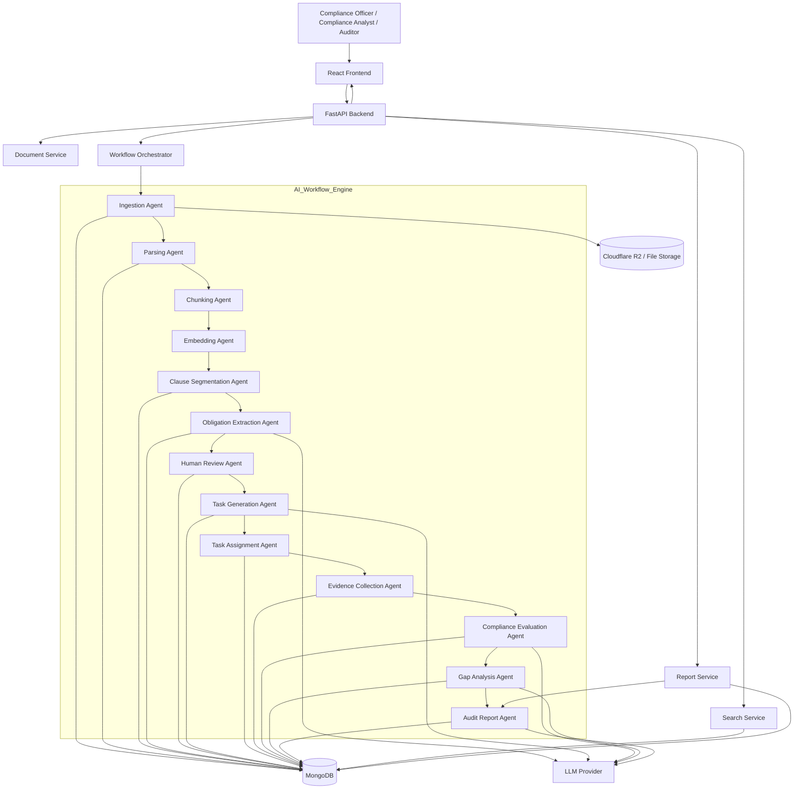

# System Architecture Document

**Project:** RegTrace
**Version:** 1.0
**Status:** Pre-Implementation
**Owner:** Team RegTrace

## 1. Purpose

This document defines the technical architecture of RegTrace, including system components, data flow, AI workflow orchestration, backend services, frontend architecture, storage, and deployment strategy.

The architecture is designed to transform SEBI regulatory documents into structured compliance actions through a modular AI agent pipeline.

---

# 2. Architecture Overview

RegTrace follows a **modular service-oriented architecture** with a React frontend, FastAPI backend, MongoDB database, and an AI workflow engine composed of independent agents.

# 4. Architectural Principles

* Modularity
* Loose coupling
* Scalability
* Auditability
* Deterministic workflow
* Human-in-the-loop validation
* API-first design
* Persistent state management

# 5. Technology Stack

| Layer               | Technology                        |
| ------------------- | --------------------------------- |
| Frontend            | React, Vite, Tailwind CSS         |
| Backend             | FastAPI (Python)                  |
| Database            | MongoDB                           |
| Document Processing | PyMuPDF, OCR fallback             |
| Embeddings          | Sentence Transformers             |
| LLM                 | Gemini / OpenAI compatible models |
| Storage             | Cloudflare R2 / Local Storage     |
| Testing             | Pytest                            |
| Version Control     | Git                               |

# 6. Application Layer Architecture

## 6.1 Presentation Layer

Responsibilities:

* Document upload
* Dashboard
* Obligation review
* Task management
* Evidence submission
* Report viewing

## 6.2 API Layer

Responsibilities:

* Request validation
* File handling
* Workflow orchestration
* Agent invocation
* Database access
* Error handling

## 6.3 Service Layer

Modules:

* Document Service
* Parsing Service
* Clause Service
* Obligation Service
* Task Service
* Evidence Service
* Compliance Service
* Report Service

## 6.4 AI Workflow Layer

Description of the multi-agent processing engine and orchestration mechanism.

# 7. AI Agent Architecture

* Ingestion Agent
* Parsing Agent
* Chunking Agent
* Embedding Agent
* Clause Segmentation Agent
* Obligation Extraction Agent
* Human Review Agent
* Task Generation Agent
* Task Assignment Agent
* Evidence Collection Agent
* Compliance Evaluation Agent
* Gap Analysis Agent
* Audit Report Agent

# 8. Workflow Orchestration

End-to-end processing flow from document upload to audit report generation.

# 9. Document State Machine

State transitions:

UPLOADED → PARSED → CHUNKED → EMBEDDED → CLAUSES_CREATED → OBLIGATIONS_EXTRACTED → OBLIGATIONS_REVIEWED → TASKS_CREATED → TASKS_ASSIGNED → EVIDENCE_SUBMITTED → COMPLIANCE_EVALUATED → GAP_ANALYSIS_COMPLETED → REPORT_GENERATED

# 10. Backend Architecture

Directory structure and responsibilities of:

* api/
* services/
* agents/
* models/
* schemas/
* prompts/
* db/
* utils/

# 11. Frontend Architecture

Directory structure and organization of:

* pages/
* components/
* features/
* services/
* hooks/
* utils/

# 12. Database Architecture

Collections:

* documents
* clauses
* obligations
* reviews
* tasks
* evidence
* compliance_evaluations
* gaps
* audit_reports

Entity relationships.

# 13. Search Architecture

* Keyword search
* Semantic search
* Metadata filtering
* Vector retrieval workflow

# 14. Error Handling Architecture

* Agent-level error handling
* Retry strategy
* Failure states
* Logging
* Recovery mechanism

# 15. Logging and Observability

* API logs
* Agent execution logs
* Workflow tracing
* Error logs
* Audit logs

# 16. Security Architecture

* Input validation
* File security
* API security
* Data integrity
* Audit protection

# 17. Scalability Architecture

* Independent agent scaling
* Horizontal backend scaling
* Concurrent document processing
* Stateless API servers
* Future queue integration

# 18. Deployment Architecture

## Development Environment

* React
* FastAPI
* MongoDB

## Production Environment

Browser → React Frontend → FastAPI Backend → MongoDB → Cloudflare R2 → LLM Provider

# 19. Architectural Decisions

Justification for:

* MongoDB
* FastAPI
* React
* Multi-agent pipeline
* Human review stage

# 20. Future Architectural Extensions

* Authentication
* RBAC
* Notifications
* Regulatory change monitoring
* Enterprise integrations
* Distributed workers
* Event-driven architecture

# 21. Summary

Overall architecture recap and how the layers interact to convert SEBI regulatory text into operational compliance actions.
