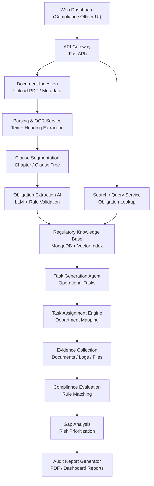
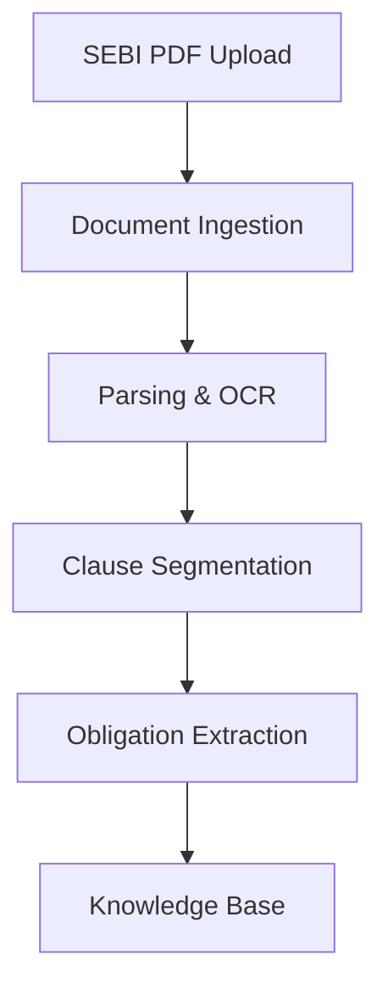
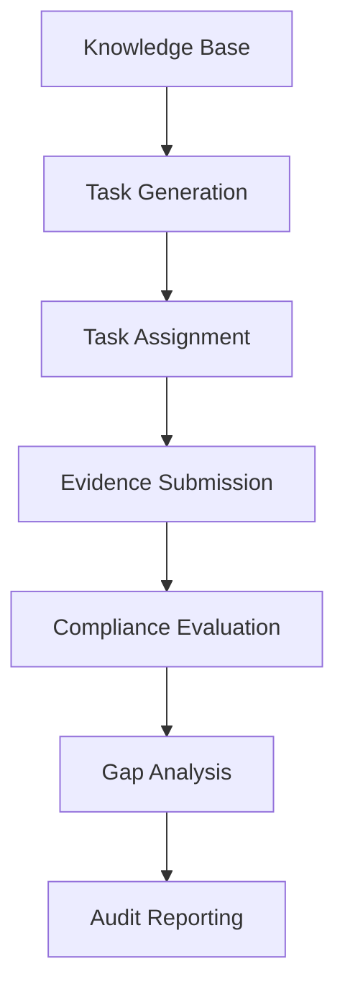

# Phase 1: problem analysis 

## Problem

Stockbrokers operate under a continuously evolving SEBI regulatory framework that includes master circulars, notifications, and guidelines containing numerous compliance obligations. Compliance teams must manually interpret regulatory text, determine applicable obligations, map them to operational processes, assign responsibilities, collect evidence of compliance, and maintain audit trails. This process is time-consuming, prone to inconsistent interpretation, delayed implementation, missing evidence, and compliance gaps, particularly for organizations with limited compliance resources.

## Problem Definition (Refined Understanding)

The core problem is not merely reading SEBI regulations, but converting them into operational compliance actions that a stockbroker can execute, monitor, and prove during audits. SEBI Master Circulars are written as unstructured legal text, while compliance operations require structured obligations, task assignments, evidence collection, and audit-ready records. The challenge is to automatically identify applicable regulatory obligations from the SEBI Master Circular for Stockbrokers, map them to the relevant operational functions within a stockbroking organization, generate actionable compliance tasks, track their completion, and maintain a complete traceable audit trail. The solution must reduce the time, inconsistency, and manual effort involved in translating regulatory changes into verifiable operational compliance.

## Solution Objective

### Refined measurable problem statement

Develop an **agentic compliance platform for stockbrokers** using the **SEBI Master Circular for Stockbrokers** as the regulatory corpus. The platform must automatically transform regulatory clauses into **machine-actionable compliance obligations**, assign them to operational owners, generate compliance tasks and evidence requirements, maintain an auditable traceability graph, and identify compliance gaps before regulatory inspection.

A solution is considered successful if, on a benchmark set of stockbroker regulatory clauses, it achieves **≥90% obligation extraction precision**, **≥85% recall**, **≥95% applicability accuracy**, generates actionable tasks for **≥90% of applicable obligations**, reduces document-to-task processing time to **under 15 minutes**, and provides **100% traceability from document to evidence and compliance status**.

## Functional Requirements

1. **Regulatory Document Upload**

   * The system shall allow users to upload SEBI Master Circulars for Stockbrokers in PDF format.
   * The system shall extract text and preserve page numbers, headings, sections, and clause references.

2. **Regulatory Clause Identification**

   * The system shall automatically identify and segment individual regulatory clauses from the uploaded circular.
   * The system shall preserve the hierarchical structure (chapter, section, subsection, clause).

3. **Obligation Extraction**

   * The system shall detect clauses that impose compliance obligations on stockbrokers.
   * The system shall extract the obligation, responsible entity, action required, and any stated timelines or conditions.

4. **Applicability Classification**

   * The system shall determine whether a regulatory clause applies to stockbrokers.
   * The system shall classify obligations by operational domain (e.g., KYC, margin, cybersecurity, client funds, reporting, audit).

5. **Compliance Task Generation**

   * The system shall convert each applicable obligation into one or more actionable compliance tasks.
   * Each task shall include a description, responsible department or owner, priority, deadline or recurrence rule, and required evidence.

6. **Task Assignment**

   * The system shall assign generated tasks to predefined operational owners or departments within the stockbroking organization.
   * The system shall support manual reassignment when required.

7. **Evidence Management**

   * The system shall allow users to upload documents, reports, logs, or other artifacts as evidence for each compliance task.
   * The system shall link uploaded evidence directly to the corresponding obligation and task.

8. **Compliance Status Tracking**

   * The system shall track the status of each task (Pending, In Progress, Completed, Overdue).
   * The system shall maintain timestamps and user actions for every status change.

9. **Compliance Gap Detection**

   * The system shall identify obligations that have no associated task, no evidence, or overdue completion.
   * The system shall generate alerts for missing or incomplete compliance actions.

10. **Audit Trail Generation**

    * The system shall maintain a complete traceability chain from Document → Clause → Obligation → Task → Evidence → Compliance Status.
    * The system shall record all user actions and system-generated updates for audit purposes.

11. **Search and Retrieval**

    * The system shall allow users to search regulations, clauses, obligations, tasks, and evidence.
    * The system shall support filtering by status, department, date, and regulatory domain.

12. **Compliance Reporting**

    * The system shall generate audit-ready compliance reports summarizing obligations, task completion, evidence availability, and compliance gaps.
    * The system shall allow reports to be exported in PDF format.

13. **Regulatory Change Processing**

    * The system shall process newly uploaded or amended SEBI circulars.
    * The system shall identify new, modified, and removed obligations compared with previously processed versions.

## Non-Functional Requirements

1. **Performance**

   * The system shall process a SEBI Master Circular (up to 500 pages) and generate obligations and compliance tasks within **15 minutes** under normal operating conditions.
   * Search and retrieval operations shall return results within **2 seconds** for up to **10,000 stored obligations**.

2. **Accuracy**

   * The system shall achieve high accuracy in identifying applicable regulatory obligations and generating compliance tasks.
   * Extracted obligations shall preserve clause references and regulatory context without altering their meaning.

3. **Reliability**

   * The system shall operate with **99% availability** during business hours.
   * Uploaded documents, obligations, tasks, and evidence records shall not be lost in the event of a system failure.

4. **Scalability**

   * The system shall support processing multiple SEBI circulars and amendments over time.
   * The architecture shall allow additional intermediary categories (e.g., investment advisers, asset management companies) to be added without major redesign.

5. **Security**

   * All uploaded regulatory documents and compliance evidence shall be stored securely.
   * Access to compliance records shall require authenticated user accounts.
   * Role-based access control shall restrict actions such as task assignment, evidence upload, and report generation.

6. **Auditability**

   * Every system action, including document upload, obligation extraction, task creation, status updates, and evidence submission, shall be recorded with timestamps and user information.
   * The system shall maintain a complete traceable audit trail from **Document → Clause → Obligation → Task → Evidence → Compliance Status**.

7. **Maintainability**

   * The system shall use a modular architecture so that document parsing, obligation extraction, task generation, and reporting components can be updated independently.
   * Regulatory extraction prompts and business rules shall be configurable without modifying core application logic.

8. **Usability**

   * Compliance officers with minimal technical expertise shall be able to upload a circular, review extracted obligations, assign tasks, and generate reports through an intuitive web interface.
   * The interface shall provide clear navigation, search, filtering, and status indicators.

9. **Consistency**

   * Identical regulatory clauses processed multiple times shall produce the same obligation structure and task generation output.
   * Clause numbering, headings, and document references shall remain consistent across all generated records.

10. **Compliance and Data Integrity**

    * The system shall preserve the original uploaded SEBI document unchanged.
    * All generated obligations and tasks shall retain references to the exact source clause and page number to ensure legal traceability.

## Success Metrics / Evaluation Criteria

The proposed AI-powered compliance system will be evaluated using the following measurable criteria:

| Metric                                      | Target                                                                                                      |
| ------------------------------------------- | ----------------------------------------------------------------------------------------------------------- |
| **Obligation Extraction Precision**         | ≥ 90%                                                                                                       |
| **Obligation Extraction Recall**            | ≥ 85%                                                                                                       |
| **Applicability Classification Accuracy**   | ≥ 95%                                                                                                       |
| **Compliance Task Generation Success Rate** | ≥ 90% of applicable obligations converted into actionable tasks                                             |
| **Evidence Mapping Accuracy**               | ≥ 90% of tasks linked to appropriate evidence requirements                                                  |
| **Processing Time**                         | A SEBI Master Circular processed and converted into compliance tasks within **15 minutes**                  |
| **Search Response Time**                    | ≤ 2 seconds                                                                                                 |
| **Audit Traceability**                      | 100% traceability from **Document → Clause → Obligation → Task → Evidence → Compliance Status**             |
| **Compliance Gap Detection Accuracy**       | ≥ 95% of missing or overdue obligations correctly identified                                                |
| **Manual Effort Reduction**                 | At least **70% reduction** in time spent by compliance teams on regulatory interpretation and task creation |

### Evaluation Method

The system will be tested using selected chapters from the **SEBI Master Circular for Stockbrokers**. A manually annotated benchmark dataset of regulatory clauses and expected obligations will serve as the ground truth. The generated obligations, tasks, evidence requirements, and compliance status outputs will be compared against this benchmark to measure precision, recall, and operational effectiveness.

A solution will be considered successful if it meets the target thresholds for obligation extraction, applicability classification, task generation, audit traceability, and processing time while demonstrating the complete compliance workflow on at least one real stockbroker regulatory scenario.

# Phase 2: Solution Engineering

## Terminologies

**Clauses (rule)** → the written rules inside the circular.
- Example: Clause 2.1 – Disclosure of financial results within 45 days of quarter end.

**Obligations (duty)** → the actions or responsibilities those rules impose on you.
- Example: From the clause above, the obligation is that companies must file quarterly results within 45 days.

**Compliance (action of obeying that duty)** → The process of actually following those obligations in practice, within the timelines and formats prescribed.
- Example: The company does file those results on time and in the required format.

## Domain Research: Stockbroker Compliance Ecosystem (Summary)

The selected intermediary category is **SEBI-registered stockbrokers**, and the regulatory corpus is the **SEBI Master Circular for Stock Brokers**. A stockbroker operates under a highly regulated securities market framework and must comply with numerous obligations related to client onboarding, trading operations, settlement, record maintenance, risk management, reporting, cybersecurity, and investor protection.

In practice, compliance is managed by compliance officers, operations teams, technology teams, and auditors. When SEBI issues a new circular or amendment, compliance officers manually interpret the regulatory text, identify the affected business processes, create implementation tasks, coordinate with operational teams, collect evidence of compliance, and maintain audit records. This workflow is time-consuming, prone to inconsistent interpretation, and difficult to audit.

The SEBI Master Circular consolidates multiple regulatory circulars into a structured document containing operational obligations applicable to stockbrokers. Most obligations involve actions such as maintaining records, submitting reports, segregating client assets, implementing internal controls, conducting audits, and preserving evidence for regulatory inspection.

The core domain problem is that SEBI regulations exist as **unstructured legal text**, while brokerage operations require **structured, machine-actionable compliance rules**. Therefore, the proposed solution focuses on automatically transforming regulatory clauses into operational compliance actions, assigning responsible departments, defining evidence requirements, tracking implementation status, and generating auditable compliance records.

## Solution Decomposition

To solve the problem of transforming SEBI regulatory text into operational compliance action for stockbrokers, the system is decomposed into independent functional modules. Each module performs a single responsibility and passes structured output to the next stage, enabling scalability, maintainability, and auditability.

### Module 1: Document Ingestion

**Purpose:** Accept SEBI master circulars, circular amendments, notifications, and related regulatory documents.

**Inputs:** PDF/DOCX regulatory documents and basic metadata.

**Outputs:** Stored original document with document ID, version, source, and upload metadata.

---

### Module 2: Document Parsing & Structure Extraction

**Purpose:** Extract clean text and preserve the legal structure of the document.

**Tasks:**

* PDF text extraction
* OCR for scanned pages
* Detection of chapters, sections, clauses, and sub-clauses
* Preservation of page numbers and hierarchy

**Outputs:** Structured document tree with identifiable legal clauses.

---

### Module 3: Clause Segmentation

**Purpose:** Split the document into atomic regulatory clauses while preserving legal context.

**Tasks:**

* Clause boundary detection
* Hierarchical numbering extraction
* Parent-child relationship mapping

**Outputs:** Individual clause records linked to their original location in the SEBI document.

---

### Module 4: Obligation Extraction

**Purpose:** Identify actionable regulatory obligations from each clause.

**Extracted Fields:**

* Obligation statement
* Intermediary category (Stockbroker)
* Responsible function (Compliance, Operations, Technology, Finance, etc.)
* Deadline or frequency
* Evidence requirement
* Regulatory priority
* Confidence score

**Outputs:** Structured obligation objects.

---

### Module 5: Regulatory Knowledge Base

**Purpose:** Store and manage obligations across document versions.

**Functions:**

* Version control
* Amendment tracking
* Duplicate detection
* Cross-reference between related circulars
* Searchable obligation repository

**Outputs:** Central compliance knowledge base.

---

### Module 6: Task Generation

**Purpose:** Convert obligations into operational compliance tasks.

**Example Fields:**

* Task title
* Description
* Owner department
* Due date
* Recurrence
* Required documents
* Status

**Outputs:** Actionable compliance tasks.

---

### Module 7: Task Assignment & Workflow Management

**Purpose:** Route generated tasks to appropriate teams.

**Tasks:**

* Department mapping
* User assignment
* Escalation rules
* Reminder scheduling
* Approval workflow

**Outputs:** Assigned compliance workflows.

---

### Module 8: Evidence Collection

**Purpose:** Collect proof that compliance tasks have been completed.

**Evidence Types:**

* Policy documents
* Reports
* Screenshots
* System logs
* Audit files
* Database records

**Outputs:** Evidence linked to specific obligations and tasks.

---

### Module 9: Compliance Evaluation

**Purpose:** Determine whether each regulatory obligation has been satisfied.

**Checks:**

* Evidence completeness
* Deadline adherence
* Document validity
* Rule matching between obligation and submitted evidence

**Outputs:** Compliant, Non-Compliant, Partially Compliant, or Pending status.

---

### Module 10: Gap Analysis

**Purpose:** Identify missing actions and regulatory risks.

**Tasks:**

* Detect unfulfilled obligations
* Prioritize high-risk gaps
* Recommend remediation actions
* Estimate regulatory exposure

**Outputs:** Compliance gap report with remediation recommendations.

---

### Module 11: Audit Trail & Reporting

**Purpose:** Generate regulator-ready audit records.

**Reports:**

* Obligation register
* Task history
* Evidence log
* Compliance dashboard
* Audit report
* Amendment impact report

**Outputs:** Auditable reports traceable to the original SEBI clause.

---

### End-to-End Data Flow

SEBI Master Circular → Document Ingestion → Parsing & Structure Extraction → Clause Segmentation → Obligation Extraction → Regulatory Knowledge Base → Task Generation → Task Assignment → Evidence Collection → Compliance Evaluation → Gap Analysis → Audit Trail & Reporting

This modular decomposition allows each component to be developed and tested independently while supporting the complete regulatory-to-operational compliance pipeline required for SEBI-regulated stockbrokers.

## Architecture Design & Tech Stack

### High-Level Architecture

The proposed system, **RegTrace**, is an AI-driven compliance platform that converts SEBI Master Circulars for Stockbrokers into operational compliance actions. The architecture follows a modular, event-driven pipeline in which each agent performs a single responsibility and stores auditable outputs before passing control to the next stage.

#### Core Components

##### 1. Presentation Layer

**Component:** React Web Dashboard

**Users:**

* Compliance Officer
* Operations Team
* Auditor
* Management

**Functions:**

* Upload SEBI documents
* Review extracted obligations
* Approve AI outputs
* Track compliance tasks
* Upload evidence
* View dashboards and audit reports

##### 2. API Layer

**Component:** FastAPI Backend

**Responsibilities:**

* Authentication
* Document upload APIs
* Obligation APIs
* Task APIs
* Evidence APIs
* Reporting APIs
* Agent orchestration

This layer acts as the communication hub between the frontend and backend services.

##### 3. AI Agent Layer

###### Ingestion Agent

* Accepts regulatory documents
* Generates document IDs
* Stores original files
* Records metadata

###### Parsing Agent

* PDF text extraction
* OCR fallback
* Heading detection
* Page mapping

###### Clause Segmentation Agent

* Detects legal hierarchy
* Preserves chapter/section relationships
* Produces atomic clauses

###### Obligation Extraction Agent

* Identifies actionable obligations
* Extracts deadlines, responsible departments, frequencies
* Generates confidence scores
* Validates structured output

###### Task Generation Agent

Converts obligations into:

* Task title
* Description
* Owner
* Due date
* Evidence requirement
* Priority

###### Compliance Evaluation Agent

Compares submitted evidence against regulatory obligations and determines:

* Compliant
* Non-Compliant
* Partially Compliant
* Pending

###### Gap Analysis Agent

Identifies:

* Missing evidence
* Missed deadlines
* High-risk obligations
* Recommended remediation actions

###### Audit Report Agent

Generates:

* Obligation register
* Compliance summary
* Evidence matrix
* Regulatory risk report
* Audit-ready PDF report

### Data Storage Architecture

#### MongoDB Collections

| Collection         | Purpose                      |
| ------------------ | ---------------------------- |
| documents          | Original document metadata   |
| parsed_documents   | Extracted text               |
| clauses            | Segmented legal clauses      |
| obligations        | Structured obligations       |
| tasks              | Compliance tasks             |
| task_assignments   | Ownership mapping            |
| evidence           | Uploaded compliance evidence |
| compliance_results | Evaluation outcomes          |
| gap_reports        | Identified compliance gaps   |
| audit_reports      | Generated reports            |

#### Vector Database

Stores embeddings for:

* Clauses
* Obligations
* Regulatory queries

Enables semantic search and retrieval-augmented generation.

### Data Flow

#### Phase 1: Regulatory Processing

#### Phase 2: Operational Compliance

### API Design

#### Document APIs

* POST /documents/upload
* GET /documents
* GET /documents/{id}

#### Obligation APIs

* GET /obligations
* GET /obligations/{id}
* PUT /obligations/{id}/approve

#### Task APIs

* GET /tasks
* POST /tasks
* PUT /tasks/{id}

#### Evidence APIs

* POST /evidence/upload
* GET /evidence/{task_id}

#### Compliance APIs

* POST /compliance/evaluate
* GET /compliance/results

#### Reporting APIs

* GET /reports/audit
* GET /reports/gaps
* GET /reports/dashboard

### Technology Stack

| Layer          | Technology                          |
| -------------- | ----------------------------------- |
| Frontend       | React + Tailwind CSS                |
| Backend        | FastAPI (Python)                    |
| AI Framework   | LangChain / OpenAI API              |
| Database       | MongoDB                             |
| Vector Search  | FAISS / MongoDB Vector Search       |
| PDF Parsing    | PyMuPDF                             |
| OCR            | Tesseract                           |
| Authentication | JWT                                 |
| File Storage   | Cloud Storage (cloudinary)          |
| Reporting      | PDF Generator + Dashboard Analytics |

### Architectural Principles

#### Modularity

Each compliance function is implemented as an independent agent.

#### Traceability

Every task, obligation, and report maintains a reference to the original SEBI clause and page number.

#### Auditability

All actions are versioned and logged, enabling regulator-ready audit trails.

#### Human-in-the-Loop

AI-generated obligations and tasks can be reviewed and approved by compliance officers before execution.

#### Scalability

Additional intermediary categories (Depositories, AMCs, Investment Advisers, etc.) can be supported by adding new regulatory corpora without changing the core architecture.

### Example End-to-End Flow

1. Compliance officer uploads the SEBI Master Circular.
2. The system parses and segments the document into clauses.
3. AI extracts obligations such as record retention, reporting, and client fund segregation requirements.
4. Operational tasks are automatically created and assigned to Operations, Finance, or Technology teams.
5. Teams upload evidence of implementation.
6. The Compliance Evaluation Agent verifies evidence against regulatory obligations.
7. The Gap Analysis Agent identifies missing controls.
8. The Audit Report Agent generates a regulator-ready compliance report with clause-level traceability.

This architecture directly addresses SEBI’s objective of reducing the gap between regulatory issuance and operational compliance action by transforming unstructured regulatory text into structured, auditable compliance workflows.

