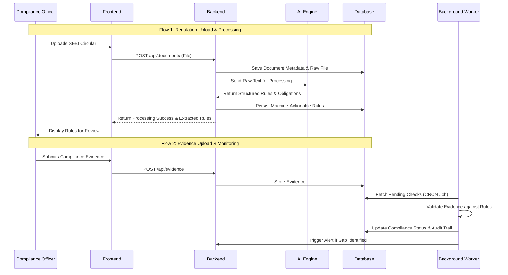
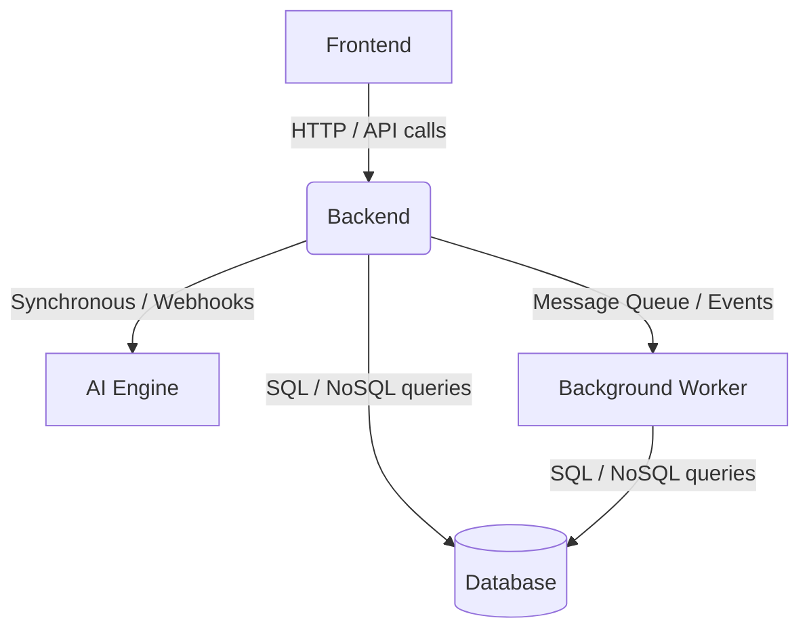

# Software Architecture Document (SAD)
**Project Name:** Agentic Compliance: From Regulatory Text to Operational Action
**Phase:** Phase 1 - Architecture Specification

---

## PART 1 — SYSTEM OVERVIEW

The Agentic Compliance platform is designed to transform unstructured regulatory texts from SEBI into structured, machine-actionable operational rules. 

**Purpose of the Platform:**
To bridge the gap between regulatory issuance and operational execution by automating the interpretation of regulatory texts and the ongoing monitoring of compliance obligations.

**Major Capabilities:**
- **Automated Regulatory Ingestion:** Processing unstructured SEBI master circulars and guidelines.
- **Dynamic Translation:** Extracting legal obligations and converting them into programmable compliance logic.
- **Workflow Mapping:** Automatically mapping structured rules to affected internal operational processes.
- **Continuous Monitoring & Evidence Tracking:** Periodically assessing fulfillment of obligations based on provided evidence.
- **Audit & Gap Analysis:** Maintaining verifiable audit trails and alerting stakeholders of compliance gaps proactively.

**End-to-End Workflow:**
1. Regulatory documents are uploaded or ingested into the system.
2. The AI Pipeline analyzes the text, extracts obligations, and generates structured compliance rules.
3. The core backend processes these rules, saving them and assigning them to the relevant market intermediary profiles.
4. Operational evidence is either uploaded by users or ingested via background integrations.
5. Scheduled background workers assess the evidence against the programmable rules.
6. The frontend displays dashboards, compliance statuses, gap alerts, and audit reports to internal compliance teams.

**High-Level Responsibilities:**
- The system must securely process and persist regulatory and compliance data.
- It must orchestrate communication between the user interface, the core business logic, the machine learning/AI models, and the background processing engines.
- It must ensure data integrity and provide tamper-evident auditability.

---

## PART 2 — ARCHITECTURAL STYLE

**Selected Architecture: Modular Service-Oriented Architecture (SOA)**

The engineering team has selected a modular, distributed architecture (microservices-inspired), effectively decoupling the system into discrete, single-purpose components (Frontend, Backend, AI Engine, Background Worker, and Database).

**Why this architecture was chosen:**
Processing unstructured legal text via Large Language Models (LLMs) or NLP pipelines is highly computationally intensive and operates on a different lifecycle than a standard transactional CRUD application. Separating the AI Engine and the Background Workers from the Core Backend ensures that intensive data processing does not block user-facing APIs.

**Benefits:**
- **Independent Scalability:** The AI Engine can be scaled with specialized compute (e.g., GPUs) independently of the Web Frontend and Core Backend.
- **Technology Diversity:** Allows the AI Engine to be written in a language suited for ML (e.g., Python), while the Core Backend can be built in a robust API-centric language (e.g., Node.js, Go, or Java).
- **Fault Isolation:** If a background worker fails or the AI pipeline times out, the web interface remains operational for the compliance teams.

**Limitations:**
- **Increased Deployment Complexity:** Requires containerization orchestration (e.g., Kubernetes/Docker Compose) to manage multiple services.
- **Data Consistency:** Requires careful design to handle asynchronous data eventual consistency across services.

**Future Evolution:**
This architecture easily supports the addition of new worker modules (e.g., for direct integration with an intermediary's internal HR or trading systems) without modifying the core regulatory translation logic.

---

## PART 3 — SYSTEM MODULES

Based on the established project structure, the system is divided into the following major modules:

### 1. Frontend
- **Purpose:** The user interface for internal compliance teams and stakeholders.
- **Responsibilities:** Displaying compliance dashboards, uploading circulars, reviewing extracted rules, mapping operational workflows, and viewing audit trails.
- **Inputs:** User interactions, file uploads, HTTP responses from Backend.
- **Outputs:** HTTP requests to Backend, rendered UI components.
- **Dependencies:** Backend.

### 2. Backend
- **Purpose:** The core API gateway and orchestrator.
- **Responsibilities:** Managing authentication, routing requests, business logic execution, data validation, and orchestrating calls between the DB, Worker, and AI Engine.
- **Inputs:** HTTP requests from Frontend, Webhooks, API calls.
- **Outputs:** JSON responses, Database queries, event triggers.
- **Dependencies:** Database, AI Engine, Worker.

### 3. AI Engine (`ai-engine`)
- **Purpose:** The regulatory translation and natural language processing unit.
- **Responsibilities:** Ingesting unstructured text, performing entity extraction, parsing legal obligations, and generating structured JSON rules.
- **Inputs:** Unstructured PDF/Text documents, contextual prompts.
- **Outputs:** Structured JSON containing mapped obligations, entities, and action items.
- **Dependencies:** None directly (stateless processing unit called by Backend).

### 4. Background Worker (`worker`)
- **Purpose:** Asynchronous task processing and scheduled job execution.
- **Responsibilities:** Running scheduled compliance checks, processing bulk evidence uploads, generating end-of-day audit reports, and sending gap remediation alerts.
- **Inputs:** Task queues, scheduled CRON triggers, Database records.
- **Outputs:** Updated database statuses, email/notification triggers.
- **Dependencies:** Database, Backend (for triggering external notifications).

### 5. Database
- **Purpose:** Persistent and secure data storage.
- **Responsibilities:** Storing user profiles, unstructured documents, structured machine rules, evidence records, and immutable audit logs.
- **Inputs:** Read/Write queries from Backend and Worker.
- **Outputs:** Result sets.
- **Dependencies:** None.

---

## PART 4 — DATA FLOW

### Data Flow Diagrams

---

## PART 5 — COMPONENT INTERACTION

**Synchronous Interactions:**
- **Frontend to Backend:** Real-time user operations (e.g., viewing dashboards, saving manual overrides, retrieving reports) use synchronous HTTP/REST (or GraphQL) requests. The user waits for the API response.
- **Backend to AI Engine:** For lightweight parsing, the backend may synchronously call the AI Engine API and wait for the response to immediately show the extracted rules to the user.

**Asynchronous Interactions:**
- **Backend to AI Engine (Large Documents):** For massive master circulars, the backend will trigger the AI Engine asynchronously. The backend returns a "Processing" status to the frontend, and the AI Engine updates the database or calls a webhook on the backend upon completion.
- **Backend to Worker:** When heavy reports are requested or bulk evidence is uploaded, the backend enqueues a message. The Worker picks it up asynchronously.

**Background Processing & Scheduled Jobs:**
- The **Worker** relies on scheduled cron jobs to perform daily compliance health checks. It independently queries the Database to find obligations lacking evidence, updates their status to "Non-Compliant," and flags them as compliance gaps.

---

## PART 6 — AI PIPELINE OVERVIEW

The conceptual pipeline for transforming regulatory text into compliance tasks involves several stages within the AI Engine:

1. **Document Ingestion:** The AI Engine receives raw files (PDFs) and performs OCR and text extraction to create a clean, machine-readable text stream.
2. **Preprocessing & Segmentation:** The text is broken down into logical sections (chapters, paragraphs) to isolate specific regulatory clauses.
3. **Information Extraction:** NLP and Large Language Models (LLMs) analyze the text to identify specific entities: the affected intermediary, the required action, the deadline, and the penalty for non-compliance.
4. **Knowledge Creation:** Extracted entities are mapped to a standardized domain ontology, resolving ambiguous legal terms into standard operational definitions.
5. **Compliance Task Generation:** The final step formats the translated knowledge into structured, machine-actionable JSON rules (e.g., generating distinct tasks like "Upload Monthly Balance Sheet by 5th of every month").

---

## PART 7 — MODULE DEPENDENCIES

**Independent vs. Dependent Development:**
- **AI Engine:** Can be developed entirely independently as a standalone API. It only requires sample SEBI texts as inputs and must adhere to a defined JSON output contract.
- **Database:** Foundational. Schemas must be defined early as Backend and Worker depend on it.
- **Backend:** Depends on the Database schema and the AI Engine's API contract. 
- **Frontend:** Depends on the Backend. Can be developed in parallel using mock APIs based on the agreed-upon Backend contracts.
- **Background Worker:** Depends on the Database and the business rules established by the Backend.

---

## PART 8 — PROJECT STRUCTURE

The logical organization of the project repository at the root level is strictly categorized by architectural concern:

- `/frontend/` — Contains all client-side UI code (views, state management, components, assets).
- `/backend/` — Contains the core API server, business logic controllers, routing, and database access layers.
- `/ai-engine/` — Contains machine learning models, NLP scripts, prompt templates, and the text-extraction pipeline.
- `/worker/` — Contains daemon processes, queue consumers, and scheduled CRON jobs for background tasks.
- `/database/` — Contains database migration scripts, seed data, and schema definitions.
- `/docker/` — Contains Dockerfiles for each module and Docker Compose files for local development and orchestration.
- `/deployment/` — Contains CI/CD pipeline scripts, infrastructure-as-code, and Kubernetes manifests for staging and production environments.
- `/DOCS/` — Contains all project documentation, architecture specifications, and project understanding artifacts.

---

## PART 9 — DEVELOPMENT ORDER

To ensure smooth integration, the modules should be implemented in the following sequence:

**1. Database & Core Architecture (`/database`, `/docker`)**
- *Prerequisites:* None.
- *Deliverables:* Local Docker Compose environment, database schemas, and migration scripts.
- *Acceptance Criteria:* Developers can spin up the DB locally and schemas are successfully applied.

**2. AI Engine (`/ai-engine`)**
- *Prerequisites:* Sample SEBI master circulars.
- *Deliverables:* A standalone API/pipeline capable of ingesting a PDF and returning structured JSON rules.
- *Acceptance Criteria:* The engine successfully processes a predefined SEBI scenario and outputs the agreed-upon JSON structure accurately.

**3. Backend (`/backend`)**
- *Prerequisites:* Database schemas, AI Engine API contract.
- *Deliverables:* Core API, authentication, CRUD operations for documents and obligations, and integration with the AI Engine.
- *Acceptance Criteria:* Frontend developers can successfully hit the API to upload a document, triggering the AI Engine and saving the results to the DB.

**4. Frontend (`/frontend`)**
- *Prerequisites:* Backend API definitions (or mocks).
- *Deliverables:* UI for document upload, rule review, evidence submission, and compliance dashboards.
- *Acceptance Criteria:* Users can navigate the application, upload documents, and view dynamic compliance states visually.

**5. Background Worker (`/worker`)**
- *Prerequisites:* Database schemas, Backend business logic rules.
- *Deliverables:* Scheduled jobs for compliance monitoring and reporting.
- *Acceptance Criteria:* The system automatically flags simulated missed obligations as compliance gaps without manual API triggers.

---

## PART 10 — ASSUMPTIONS & CONSTRAINTS

**Architectural Assumptions:**
- Cloud infrastructure will be used to host the microservices.
- SEBI circulars, while unstructured, follow a reasonably consistent semantic pattern that an AI pipeline can reliably interpret.
- The platform will primarily serve stockbrokers and investment advisers initially, establishing the baseline data models.

**Technical Constraints:**
- The AI pipeline is computationally heavy; it must not block the core Backend API. Asynchronous processing with robust error handling is mandatory.
- The system must support horizontal scaling for the Worker and Backend components to handle bursts of activity (e.g., at the end of a financial quarter).

**Business Constraints:**
- Compliance data is highly sensitive. Strict data isolation, encryption at rest, and role-based access control (RBAC) are non-negotiable.

**Compliance Constraints:**
- **Immutability of Audit Trails:** Any action taken in the system (rule mapping, evidence upload, status change) must generate an append-only audit log. True deletion of records should be avoided in favor of soft deletes and versioning.

---

## PART 11 — OUTPUT
*(This document serves as the formal Software Architecture Document (SAD) output. All subsequent development and technical design must align with the architectural decisions, module boundaries, and data flows defined herein.)*
