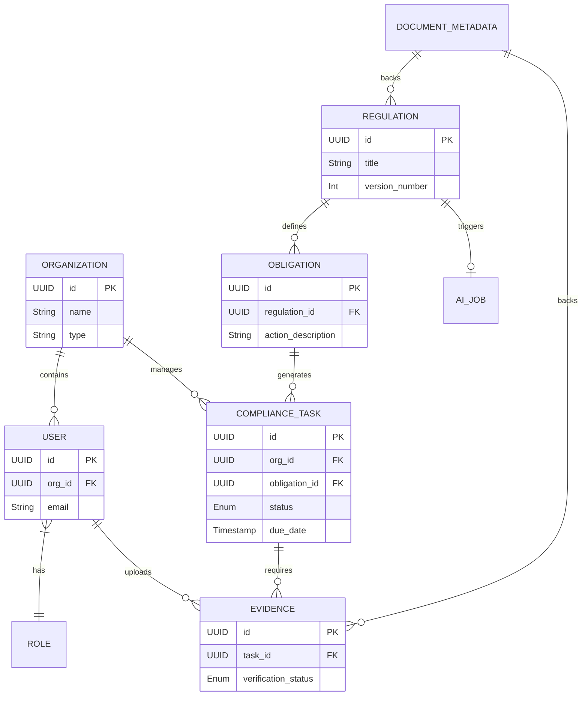

# Database Design Specification (DDS)
**Project Name:** Agentic Compliance: From Regulatory Text to Operational Action
**Phase:** Phase 2 - Database Design Specification

---

## PART 1 — DATABASE OVERVIEW

**Purpose of the Database Layer:**
The database layer serves as the secure, persistent foundation for the Agentic Compliance platform. It is responsible for storing multi-tenant user configurations, unstructured and structured regulatory content, dynamically generated compliance tasks, and tamper-evident audit trails.

**Overall Database Organization:**
The system organizes data into three logical domains:
1. **Global Domain:** Contains universally applicable regulatory texts, extracted rules, and obligations (applicable across the entire ecosystem).
2. **Tenant Domain:** Contains intermediary-specific data, including users, mapped compliance tasks, and evidence.
3. **System Domain:** Contains operational metadata, AI processing job states, and immutable audit logs.

**Data Ownership:**
- System Administrators own Global and System Domain data.
- Tenants (Market Intermediaries) own their respective Tenant Domain data, completely isolated from other tenants.

**Persistence Strategy:**
- **Relational Integrity:** Core transactional entities use strict relational models with foreign-key constraints.
- **Append-Only Auditing:** Audit logs and historical versions are strictly append-only.
- **Soft Deletions:** Records are never hard-deleted; a `deleted_at` timestamp is used to hide inactive records.

---

## PART 2 — DATABASE TECHNOLOGIES

To accommodate the varying structures of data, a polyglot persistence approach (or a multi-model approach using a capable RDBMS like PostgreSQL) is adopted.

1. **Relational Database (e.g., PostgreSQL)**
   - **Purpose:** Primary data store for the application.
   - **What it stores:** Users, Organizations, Roles, Obligations, Compliance Tasks, and Audit Logs.
   - **Why it is used:** Guarantees ACID compliance, enforces referential integrity, and supports JSON/JSONB for flexible AI outputs.
   - **What it should NOT store:** Raw binary files (PDFs/Images).

2. **Object Storage (e.g., AWS S3 or MinIO)**
   - **Purpose:** Blob storage for documents and evidence.
   - **What it stores:** Raw SEBI master circular PDFs, user-uploaded evidence documents, and generated report artifacts.
   - **Why it is used:** Cost-effective, scalable storage for large unstructured binary files.
   - **What it should NOT store:** Queryable metadata or relational states.

3. **Vector/Embedding Store (e.g., pgvector or standalone like Pinecone)** *(Conceptual)*
   - **Purpose:** Enable semantic search across regulatory texts.
   - **What it stores:** Vector embeddings of specific clauses and obligations.
   - **Why it is used:** To allow the AI Engine to perform RAG (Retrieval-Augmented Generation) and semantic deduplication of obligations.

---

## PART 3 — ENTITY CATALOG

1. **Organization:** Represents a market intermediary (tenant) such as a stockbroker or investment adviser.
2. **User:** Represents an individual accessing the platform.
3. **Role & Permission:** Defines RBAC (Role-Based Access Control) for users.
4. **Regulation:** The overarching document (e.g., Master Circular) issued by SEBI.
5. **Clause/Section:** A specific, segmented portion of the Regulation text.
6. **Obligation:** A structured, machine-actionable rule extracted from a Clause by the AI Engine.
7. **Compliance Task:** The operational manifestation of an Obligation, mapped to a specific Organization.
8. **Evidence:** Proof of compliance (e.g., file metadata, integration link) attached to a Compliance Task.
9. **Audit Log:** An immutable ledger recording all changes across the system.
10. **AI Job:** Tracks the asynchronous processing status of the AI Engine for a given Document.
11. **Document Metadata:** Metadata pointing to physical files in Object Storage.

---

## PART 4 — ENTITY SPECIFICATION

*(Conceptual Schema Design)*

### 1. Organization
- **Fields:** `id` (UUID, PK), `name` (String, Req), `type` (Enum: Stockbroker, AMC, etc., Req), `status` (Enum: Active/Inactive, Req, Def: Active), `created_at` (Timestamp), `updated_at` (Timestamp).
- **Constraints:** `name` must be unique.

### 2. User
- **Fields:** `id` (UUID, PK), `org_id` (UUID, FK, Req), `role_id` (UUID, FK, Req), `name` (String, Req), `email` (String, Req), `password_hash` (String, Req), `is_active` (Boolean, Def: true).
- **Constraints:** `email` must be unique globally.

### 3. Regulation
- **Fields:** `id` (UUID, PK), `title` (String, Req), `issuing_authority` (String, Def: 'SEBI'), `publish_date` (Date, Req), `version_number` (Integer, Def: 1), `document_metadata_id` (UUID, FK, Req).
- **Constraints:** Unique compound constraint on `(title, version_number)`.

### 4. Obligation
- **Fields:** `id` (UUID, PK), `regulation_id` (UUID, FK, Req), `target_org_type` (Enum, Req), `action_description` (Text, Req), `deadline_rule` (String, Req - e.g., 'EoD', 'Monthly 5th'), `ai_confidence_score` (Float, Opt).
- **Validation:** `ai_confidence_score` must be between 0 and 1.

### 5. Compliance Task
- **Fields:** `id` (UUID, PK), `org_id` (UUID, FK, Req), `obligation_id` (UUID, FK, Req), `assigned_user_id` (UUID, FK, Opt), `status` (Enum: Pending, Submitted, Verified, Overdue, Req, Def: Pending), `due_date` (Timestamp, Req).
- **Constraints:** Unique on `(org_id, obligation_id, due_date)` to prevent duplicate tasks for the same period.

### 6. Evidence
- **Fields:** `id` (UUID, PK), `task_id` (UUID, FK, Req), `uploaded_by` (UUID, FK, Req), `document_metadata_id` (UUID, FK, Opt), `verification_status` (Enum, Def: Pending), `comments` (Text, Opt).

### 7. Audit Log
- **Fields:** `id` (UUID, PK), `entity_name` (String, Req), `entity_id` (UUID, Req), `action` (Enum: CREATE, UPDATE, DELETE, Req), `old_values` (JSONB, Opt), `new_values` (JSONB, Opt), `performed_by` (UUID, FK, Req), `timestamp` (Timestamp, Def: Now).
- **Constraints:** Append-only. No UPDATE or DELETE allowed on this table.

### 8. AI Job
- **Fields:** `id` (UUID, PK), `regulation_id` (UUID, FK, Req), `status` (Enum: Queued, Processing, Completed, Failed, Req), `started_at` (Timestamp, Opt), `completed_at` (Timestamp, Opt), `error_log` (Text, Opt).

---

## PART 5 — RELATIONSHIPS

- **Organization 1:M User:** An organization has many users; a user belongs to exactly one organization. (Enforces multi-tenancy).
- **Organization 1:M Compliance Task:** Tasks are scoped to specific organizations.
- **Regulation 1:M Obligation:** One regulation contains multiple extracted obligations.
- **Obligation 1:M Compliance Task:** An obligation generates multiple tasks (e.g., recurring tasks) across different organizations.
- **Compliance Task 1:N Evidence:** A task can have multiple pieces of evidence submitted over time before being marked Verified.
- **User 1:M Evidence:** Users upload evidence.
- **Regulation 1:1 AI Job:** An AI job processes a specific regulation to extract obligations.

### ER Diagram

---

## PART 6 — INDEXING STRATEGY

To ensure performance, especially for dashboard and AI retrieval queries, the following indexes are required:

1. **Foreign Key Indexes:** Standard B-Tree indexes on all FKs (`org_id`, `regulation_id`, `task_id`) to speed up JOINs.
2. **Dashboard Query Index:** Compound index on `Compliance Task (org_id, status, due_date)`. 
   - *Why:* The primary view for any compliance officer is filtering their pending/overdue tasks.
3. **JSONB Indexing:** GIN (Generalized Inverted Index) on `Audit Log (new_values, old_values)`.
   - *Why:* Allows rapid searching of historical data properties within the unstructured JSONB audit payloads.
4. **Full-Text Search Index:** GIN/GiST index on `Obligation (action_description)` and `Regulation (title)`.
   - *Why:* Allows users to keyword-search through complex regulatory texts quickly.
5. **Audit Traceability:** B-Tree index on `Audit Log (entity_name, entity_id)`.
   - *Why:* To rapidly construct the timeline of a specific task or rule.

---

## PART 7 — VERSIONING

- **Regulation Versions:** Regulations use a `version_number` field. When SEBI amends a circular, a new Regulation record is created with an incremented version. Obligations map to a specific version, ensuring historical tasks remain tied to the legal rules in effect at their `due_date`.
- **Soft Deletes:** Standardized across all entities using `deleted_at`. If an obligation is rescinded by SEBI, it is soft-deleted. Future compliance tasks will not be generated, but historical ones remain intact.
- **Audit History:** Fully supported via the `Audit Log` table, acting as an event-sourcing ledger capturing the delta of every mutation.

---

## PART 8 — MULTI-TENANCY

- **Tenant Isolation:** The database utilizes a shared-schema, multi-tenant strategy. Every tenant-specific table (User, Task, Evidence) includes an `org_id` column.
- **Data Access Layer / RLS:** The Backend ORM or Database Row-Level Security (RLS) policies must automatically append `WHERE org_id = ?` to all Tenant Domain queries.
- **Shared Data:** Entities in the Global Domain (Regulations, Obligations) do not have an `org_id`. They are inherently read-only for tenants and managed exclusively by the System/AI Engine.

---

## PART 9 — AUDIT STRATEGY

Every critical entity in the system will support automatic auditing:
- **Standard Columns:** Every table includes `created_at`, `updated_at`, `created_by` (UUID), and `updated_by` (UUID).
- **The Audit Log Ledger:** Intercepted at the application or database-trigger level, any `INSERT`, `UPDATE`, or `DELETE` on monitored tables (especially Tasks and Obligations) generates an immutable record in the `Audit Log` table.
- **Payload:** Captures the timestamp, user ID, exact action, and a JSONB snapshot of `old_values` and `new_values`.

---

## PART 10 — PERFORMANCE

- **Large Documents:** Physical files remain in Object Storage. Only lightweight metadata and extracted text snippets are stored in the RDBMS.
- **Millions of Tasks:** Using compound indexes (as defined in Part 6) ensures rapid retrieval for the active operational window.
- **Archiving & Data Retention:** Compliance Tasks and Evidence older than 7 years (standard financial retention) will be aggressively partitioned by year and moved to cold storage (e.g., S3 Parquet files) to keep active tables small.
- **Table Partitioning:** The `Audit Log` table will be partitioned monthly natively within the RDBMS to maintain insert performance and facilitate easy archiving.

---

## PART 11 — SECURITY

- **Sensitive Fields:** `password_hash` in the User table. Any PII found within Evidence must be handled carefully.
- **Encryption Requirements:** Data must be encrypted at rest (TDE - Transparent Data Encryption) at the database layer. Connection strings and access must enforce TLS (encryption in transit).
- **Access Restrictions:** The database should reside in a private subnet. The Backend and Worker are the only services permitted to open direct connections.
- **Data Ownership Protection:** Strict enforcement of the `org_id` multi-tenancy rules ensures that no intermediary can query or access compliance evidence or task statuses belonging to a competitor.
